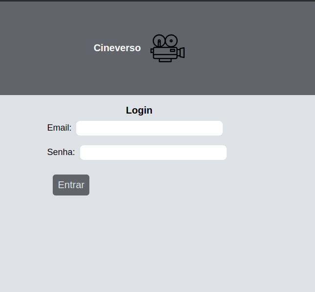
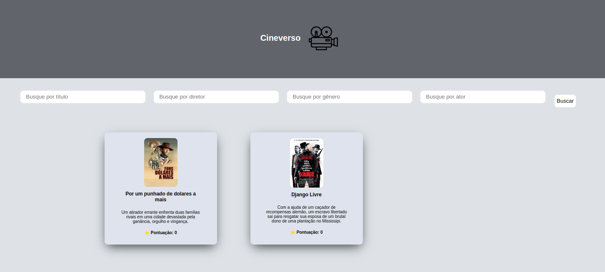

# Cineverso Front 🎥

## Projeto front-end do cineverso, para amantes da sétima arte


## Escolhas do projeto
- Foi escolhido inicialmente um padrão de projeto componentizado, com estilizações múltiplas para os componentes, como por exemplo o componente Button, que através das propriedades ele apresentará uma estilização diferente. Além disso, foi escolhido a renderização de views, para agrupar esses componentes e através do React router dom, ter a navegação entre essas views. 

## Milestones
- [x] Implentação de lógica de Autorização 
- [x] Implementação de página de Login
- [x] Implementação de página de listagem de filmes
- [x] Implementação de busca de filmes por filtro
- [ ] implementação de página de usuário
- [ ] implementação de criação de filme 
- [ ] implementação de página de filme específico
- [x] implementação de serviços Http 


### Tecnologias usadas:
 - Node Js
 - React
 - Vite


## Como rodar o projeto

- Primeiramente para rodar o projeto, você irá precisar do Node versão 20.17 em seu ambiente de trabalho, além de algum gerenciador de pacote da sua preferência (npm, yarn)

- Após instalação, abra seu projeto no terminal ou em qualquer editor de código(IDE), e instale as dependências com o comando:
```
  npm install 
```
ou 

```
yarn 
```

- Assim que o gerenciador de dependências terminar a instalação, você poderá rodar a aplicação com o comando:

```
npm run dev
```

ou 

```
yarn dev
```

A aplicação irá rodar na porta padrão _5173_.4 


## Previews
Login


Listagem de filmes e página principal, com busca por filtro
